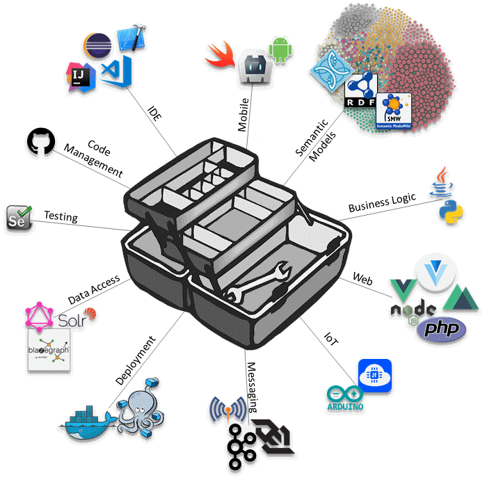

# Code Examples

This repository aims to illustrate some of the technologies that are contained within my personal toolbox and includes the following code examples:

## [OpenAnno](https://github.com/frank-fzi/examples/tree/master/OpenAnno)

OpenAnno is a prototypical demonstrator of a semantic annotation tool. It takes an RDF description of an entity as input and queries multiple linked data endpoints for semantic similar entities. Further, it allows to create rich annotations to link those entities based on the Web annotation model. OpenAnno is implemented in Java and employs Apache Jena.

## [MDP](https://github.com/frank-fzi/examples/tree/master/MDP)

MDP showcases a self-learning data transformation pipeline that implements a Markov decision process with Python3. The example contains data for nine states and nine actions that can be applied to that states. There are also plots available to visualize the processing time.

## [iotMatrix](https://github.com/frank-fzi/examples/tree/master/iotMatrix)

iotMatrix is a collection of an Arduino script and three dedicated libraries that enables a microcontroller unit like the ESP8266 to control a double-sided matrix of WS2812B pixels. It allows to show text, images or other content based on NTP, Web requests or WebSocket inputs.  

## [iotVuetify](https://github.com/frank-fzi/examples/tree/master/iotVuetify)

iotVuetify is cross-platform Javascript app to control an iotMatrix over WebSocket. Based on Vuetify.js, it can be deployed as a (Docker) Web application or on mobile devices running Android or iOS. 

# Further References

Most of my contributions in the recent years are made to the following projects:

* [The BigGIS Project](https://github.com/biggis-project "See on GitHub")
* [The SeRoNet Project](https://github.com/seronet-project "See on GitHub")

Please be aware that not all repositories of these projects are public (yet), therefore only limited insights can be granted. 

# Projects with Closed Sources

For some of my projects the source code is not published due to varying reasons. They are listed in the following:

* [KA-Feedback](https://itunes.apple.com/us/app/ka-feedback/id394727577 "See in App Store")
 <small>iOS App implemented in Swift 3</small>
* Automated functional and performance testing of Web based applications
 <small>implemented in Java including Selenium</small>
* Corporate Lessons Learned Management System
 <small>Based on Semantic MediaWiki</small>
* Corporate Team and Project Management System
 <small>Based on Semantic MediaWiki</small>
